<h1 align="center">Hi  I'm Enzo Bocalon.</h1>

    <h2>😉 About Me </h2>
    
I'm 24 years old and a tech enthusiast.

 
  

<h2 align="left">Some personal stuff</h2>
<ul>
<li> 📚 I enjoy working with web technologies and creating Minecraft mods;</li>
<li> 🖥 Graduated in Computer Engineering from Unifev in 2026; </li> 
<li> 🇧🇷 Born and living in Brazil;</li>
</ul>
 

<h2>🌐 Social Medias</h2>

<h1></h1>

  

