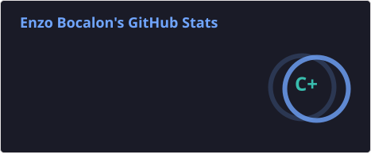
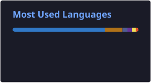

# Hey there! 👋

### Web developer · Open-source enthusiast · Minecraft modder

Building useful things for the web and experimenting with code, interfaces, and game development.

  

## About

- 💻 Interested in web technologies and clean, practical solutions
- 🧩 Exploring Minecraft modding and creative development
- 🚀 Always learning, building, and improving

## Tech stack

  

## GitHub activity

  
  

### Thanks for stopping by! ⭐

